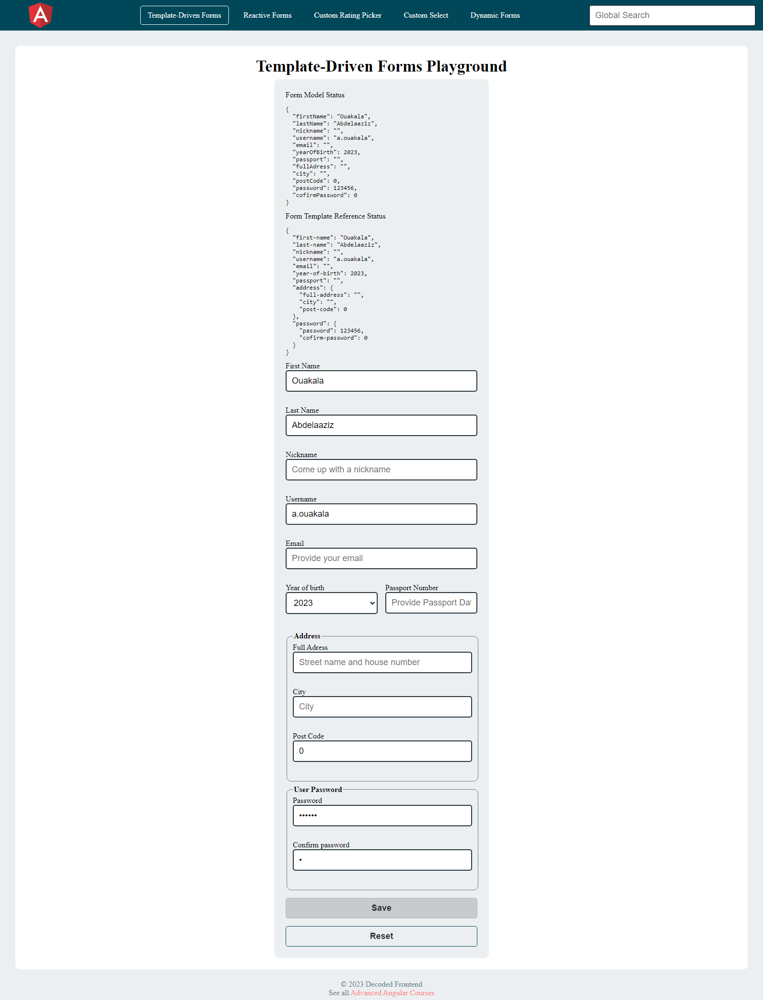
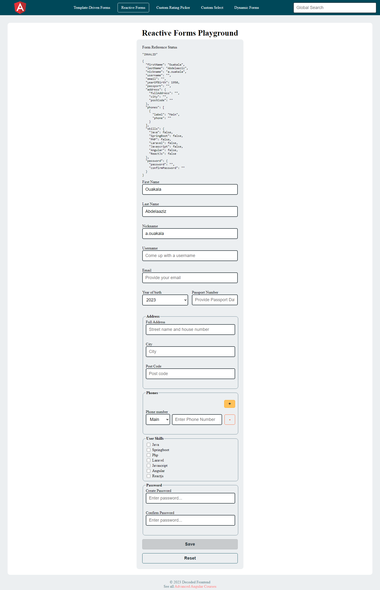
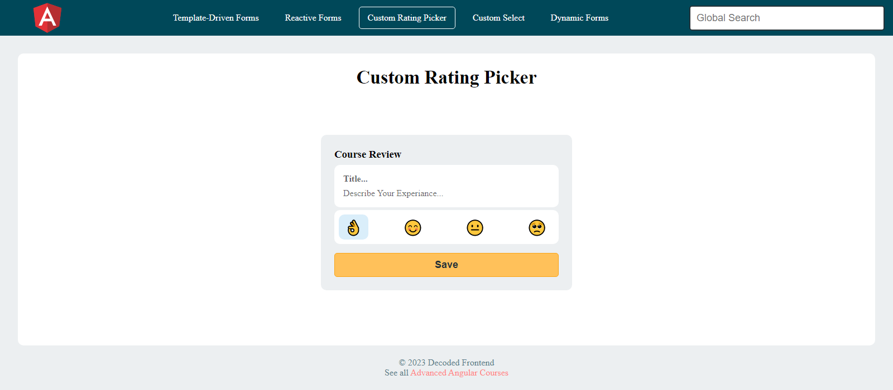
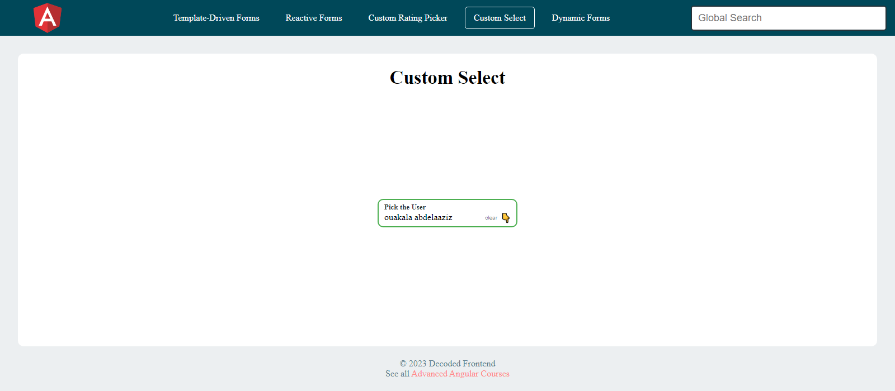
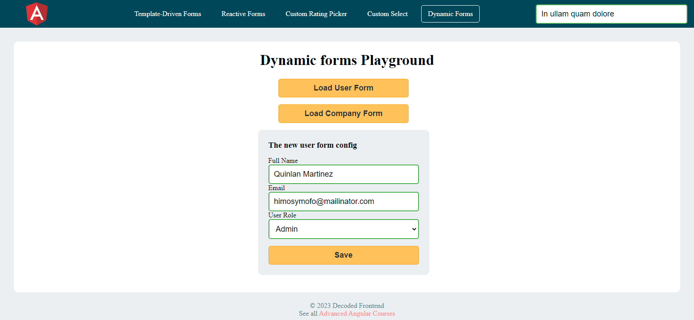

# Advanced Angular Form Manipulation Using Angular

#### Deep Dive in Angular Forms V14
The course goes way beyond the official documentation and shows you how the Angular forms work internally, so You understand why things work as they work.

[⬆ back to top](#advanced-angular-form-manipulation-using-angular)

#### Course Content
> Almost 110 Videos (≈ 12.5 Hours) dedicated to Angular Forms created by Google Developer Expert in Angular and Microsoft MVP in Developer Technologies

> The course covers both Template-Driven and Reactive Forms

> You will learn how dynamically generate a form with validators from a simple JSON object

> Deep understanding of what is going on under the Hood by reviewing and analyzing the source code of Angular Forms

> Forget about Angular Material hacking! 😌 You will be able to build your own complex form controls like Select Component which supports multi-selection, accessible keyboard navigation and option filtering

> Solid understanding of the different types of validations and how to create custom validators

> How to implement a scalable architecture for validation errors management

[⬆ back to top](#advanced-angular-form-manipulation-using-angular)

## Screenshots
##### Template Driven Forms

[⬆ back to top](#advanced-angular-form-manipulation-using-angular)

##### Reactive Forms

[⬆ back to top](#advanced-angular-form-manipulation-using-angular)

##### Custom Rating Picker Control

[⬆ back to top](#advanced-angular-form-manipulation-using-angular)

##### Custom Select Dropdown Control

[⬆ back to top](#advanced-angular-form-manipulation-using-angular)

##### Dynamic Forms Controls

[⬆ back to top](#advanced-angular-form-manipulation-using-angular)

## License
MIT
**Free Software, Hell Yeah!**
